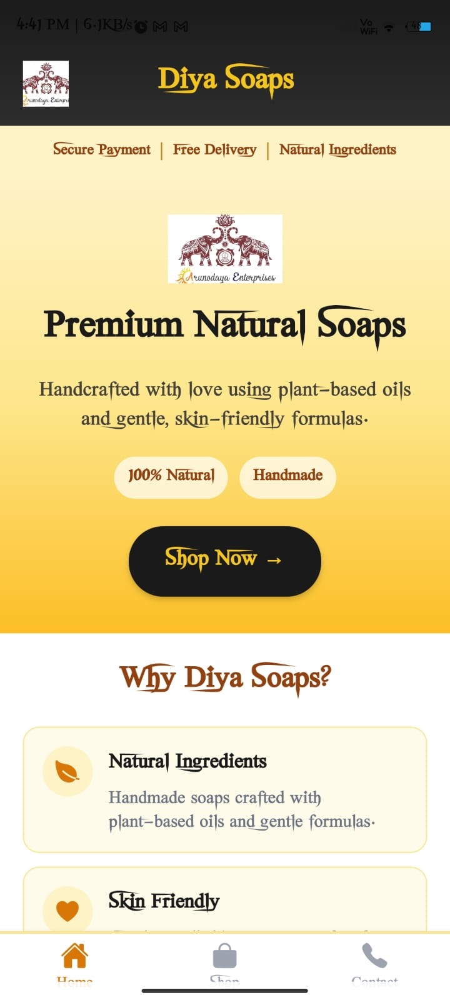
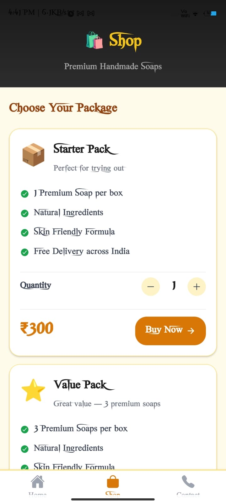
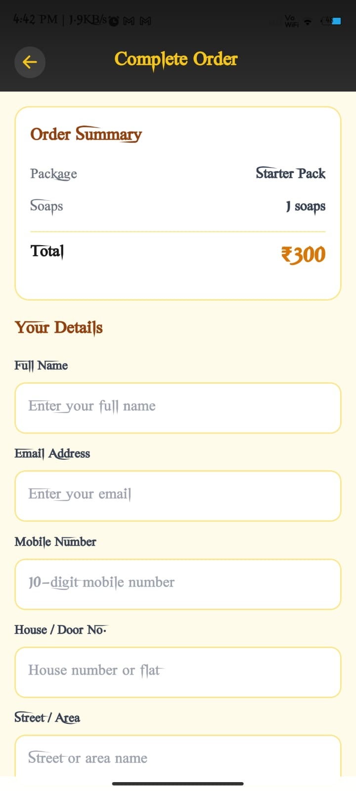
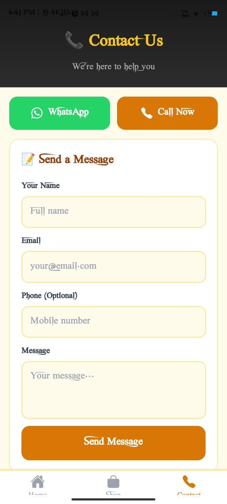

# 🧼 Diya Soaps – E-commerce Mobile App (Flutter)

A fully responsive E-commerce mobile application built using Flutter, designed for selling handmade soaps. This app provides a smooth shopping experience with modern UI, product browsing, and user-friendly navigation.

🚀 Features

🛍️ Product Listing & Details
🔍 Search Functionality
❤️ Wishlist Support
📱 Fully Responsive UI
⚡ Fast Performance with Flutter

🛠️ Tech Stack

* **Frontend:** Flutter (Dart)
* **State Management:** (Riverpod)
* **Backend/API:** (Node.js)
* **Storage:** SharedPreferences

📸 Screenshots

🏠 Home Screen

🛍️ Product Listing

📦 Product Details

📱 Contact Screen

📂 Project Structure

lib/
│── constants/
│── models/
│── providers/
│── screens/
│── main.dart

⚙️ Installation & Setup

1. Clone the repository: git clone https://github.com/your-username/diyasoaps_flutter.git

2. Navigate to project folder:

cd diyasoaps_flutter

3. Install dependencies:

flutter pub get

4. Run the app:

flutter run

📲 Download App

Applink : https://play.google.com/store/apps/details?id=com.diyasoaps.app

🎯 Project Highlights

* Clean and scalable architecture
* Beginner-friendly and production-ready structure
* Designed with real-world e-commerce use case
* Smooth UI/UX with modern Flutter components

---

📌 Future Improvements :

💳 Payment Gateway Integration 
📦 Order Tracking System
🔔 Push Notifications
🌐 Backend Integration with APIs

🙋‍♂️ Author:Lokesh Gapagari

B.Tech Graduate
Flutter Developer
Passionate about building real-world applications

⭐ Show Your Support

If you like this project, please ⭐ the repository and share it!

